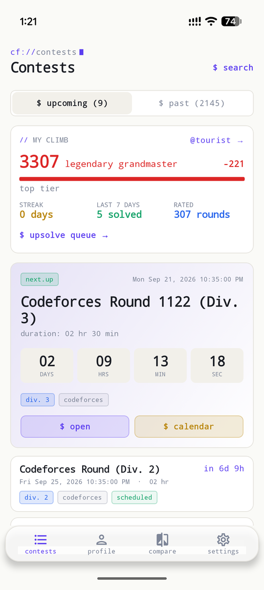
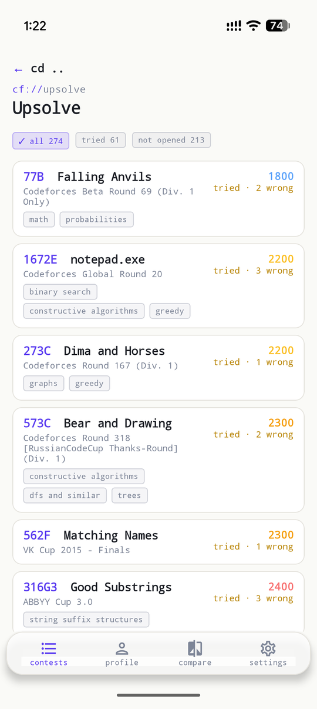
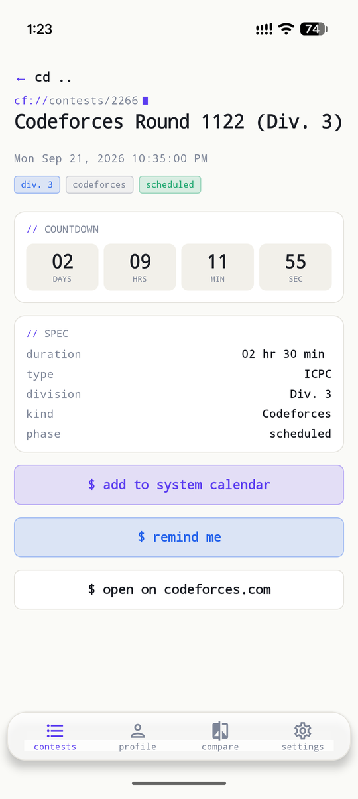
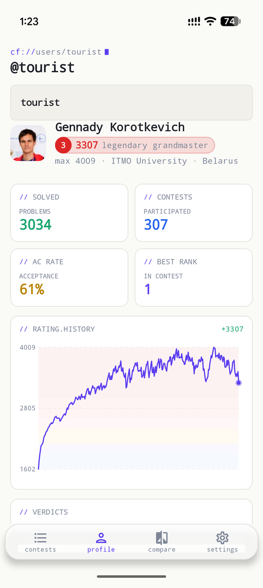
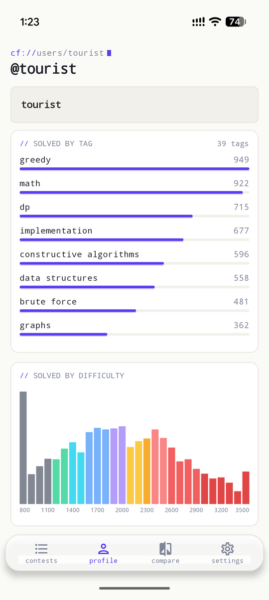
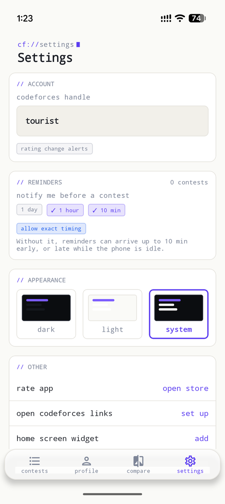

# CFClimb

**CFClimb – Codeforces Trainer** for Android and iOS. It follows the weekly cycle of a competitive
programmer: get reminded, compete, see the result, and look back at your progress.

Unofficial. Not affiliated with Codeforces. Data comes from the public
[Codeforces API](https://codeforces.com/apiHelp).

## Features

- **Contests:** upcoming, live and past rounds, with running rounds pinned on top, a countdown to
  the next one, pull-to-refresh and add-to-calendar.
- **Reminders:** notifications 1 day, 1 hour or 10 minutes before the rounds you pick, rescheduled
  when Codeforces moves a round.
- **Rating change alerts:** a background check for your saved handle that notifies you when a new
  rating is published.
- **Home-screen widget:** next round and your rating (Glance on Android, WidgetKit on iOS).
- **Profiles:** rating history, solved problems by difficulty and tag, verdicts, languages and an
  activity heatmap.
- **Compare:** two handles side by side.
- **Shared links:** Codeforces profile and contest links open in the app ("Share → CFClimb" on
  Android, `cfclimb://` links on both platforms).
- **Offline first:** everything you have opened is saved, so the app works without a connection.

## Tech

- Kotlin Multiplatform with Compose Multiplatform for the UI on both platforms
- Room (KMP) database as the source of truth, Ktor for the API with a request throttle that
  respects the Codeforces rate limit
- Koin, kotlinx-datetime, DataStore
- WorkManager and `BGTaskScheduler` for background checks, Glance and WidgetKit for widgets
- Tests: kotlin.test, Turbine, Ktor `MockEngine` contract tests, Robolectric and Roborazzi screenshot
  tests; GitHub Actions builds and tests Android and iOS

Modules: `composeApp` (UI and platform code), `shared` (data and domain), `iosApp` (Xcode project
and widget extension).

## Build and test

```bash
./gradlew :composeApp:installDebug
```

```bash
./gradlew :shared:testAndroidHostTest :composeApp:testDebugUnitTest :composeApp:verifyRoborazziDebug
```

```bash
./gradlew :shared:iosSimulatorArm64Test :composeApp:iosSimulatorArm64Test
```

Open `iosApp/iosApp.xcodeproj` in Xcode to run the iOS app.

## Screenshots

Captured on a Pixel 10 Pro.

<p align="center">
  
  
  
</p>
<p align="center">
  
  
  
</p>

## Download

- [App Store](https://apps.apple.com/us/app/cfclimb-codeforces-trainer/id6775346654)
- [Google Play](https://play.google.com/store/apps/details?id=com.codeforcesvisualizer)
